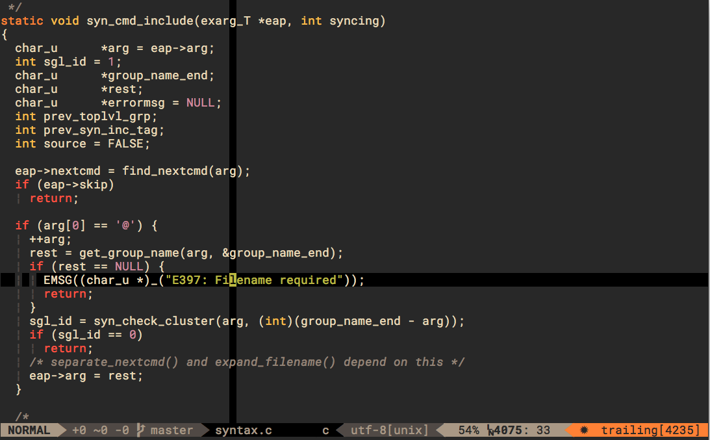
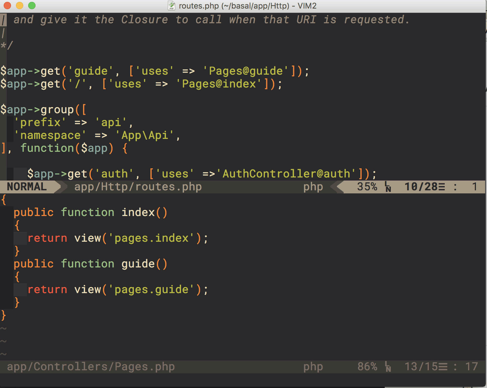
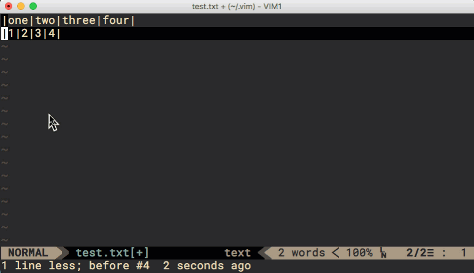
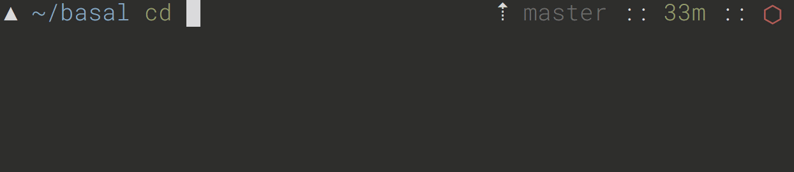

# kevins' dotfiles

## Installation

* Install [MacVim](https://macvim-dev.github.io/macvim/)

* Get rid of our titlebar
```shell
defaults write org.vim.MacVim MMNoTitleBarWindow true
```
 

* Install [vim-plug](https://github.com/junegunn/vim-plug)
```bash
 curl -fLo ~/.vim/autoload/plug.vim --create-dirs \
   https://raw.githubusercontent.com/junegunn/vim-plug/master/plug.vim
```
* Open vim, type :PlugInstall to get the latest of all the vim plugins


* Install the [Powerline-patched fonts](https://github.com/powerline/fonts)
  * I currently have the .vimrc pointed to [Robot Mono for Powerline](https://github.com/powerline/fonts/blob/master/RobotoMono/Roboto%20Mono%20for%20Powerline.ttf) [Here](https://github.com/acidjazz/dotfiles/blob/master/.vimrc#L143)

* Install [LS_COLORS](https://github.com/trapd00r/LS_COLORS)
```shell
wget https://raw.github.com/trapd00r/LS_COLORS/master/LS_COLORS -O $HOME/.dircolors
```

* Install [LSDeluxe](https://github.com/Peltoche/lsd)
```shell
brew install lsd
```

* Install [powerline](https://github.com/b-ryan/powerline-shell#bash)
```shell
pip install powerline-shell
```
 * Update your `.bash_profile` [here](https://github.com/b-ryan/powerline-shell#bash)

## Configuration

 * Overwrite your current default `.vimrc` with the one in this repository
   * Review and customize to your preferences
 * Overwrite your current default `.bash_profile` with the one in this repository
   * Review and customize to your preferences

## VIM Examples

### Standard look with all the plugins active



### Using the fuzzy finder [ctrlp](https://github.com/ctrlpvim/ctrlp.vim) to bring up a pug view, (ctrl+enter splits it in)



### Easymotion example


### Easymotion Overwin motions

* Type \ to initiate easywin
* `f` for a search, `s` for char, `L` for line, `w` for word
* a letter in the word you are looking for (for f & s)
* then the letter presented (highlighted) 
* you are now anywhere in your file(s) w/in 4 keystrokes


### [Tabular.vim](https://github.com/godlygeek/tabular)

Before:
```
one = 1
two = 2
three = 3
four = 4
```
Running :Tab /= produces:
```
one   = 1
two   = 2
three = 3
four  = 4
```


Check out the [Vimcast](http://vimcasts.org/episodes/aligning-text-with-tabular-vim/)  for more detail

## BASH Examples
* git-friendly command prompt showing 
  * branch, push status, dirty or clean status, time from last commit
* color coded directories and files
* on-the-fly syntax highlighting as you type


* folder/file/everything autocompleted




