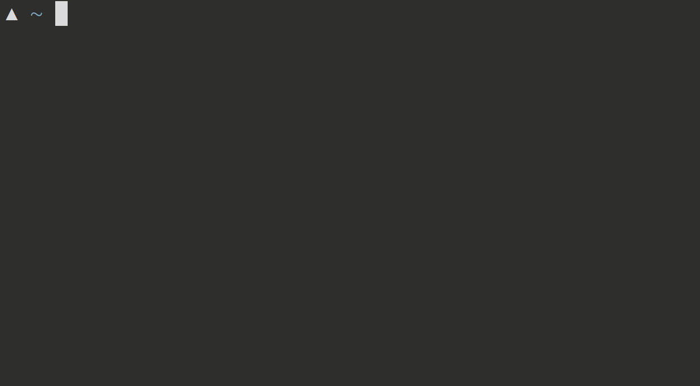

# acidjazz' dotfiles

* git-friendly command prompt showing branch
  * push status, dirty or clean status, time from last commit
* color coded directories and files
* on-the-fly syntax highlighting as you type



* folder/file/everything autocompleted


### Installation

* Install [vim-plug](https://github.com/junegunn/vim-plug)
```bash
 curl -fLo ~/.vim/autoload/plug.vim --create-dirs \
   https://raw.githubusercontent.com/junegunn/vim-plug/master/plug.vim
```
* Open vim, type :PlugInstall, to install all the vim plugins


* Install the [Powerline-patched fonts](https://github.com/powerline/fonts)
  * I currently have the .vimrc pointed to [Robot Mono for Powerline](https://github.com/powerline/fonts/blob/master/RobotoMono/Roboto%20Mono%20for%20Powerline.ttf) [Here](https://github.com/acidjazz/dotfiles/blob/master/.vimrc#L143)

* Install [LS_COLORS](https://github.com/trapd00r/LS_COLORS)
```shell
wget https://raw.github.com/trapd00r/LS_COLORS/master/LS_COLORS -O $HOME/.dircolors
```

* Install [oh-my-zsh](https://github.com/robbyrussell/oh-my-zsh)

```shell
sh -c "$(wget https://raw.githubusercontent.com/robbyrussell/oh-my-zsh/master/tools/install.sh -O -)"
```

* Install [geometry](https://github.com/frmendes/geometry)
```shell
mkdir ~/.oh-my-zsh/custom/themes
wget https://raw.githubusercontent.com/frmendes/geometry/master/geometry.zsh -O $HOME/.oh-my-zsh/custom/themes/geometry.zsh-theme
```
 
### Configuration

 * 


### Examples


